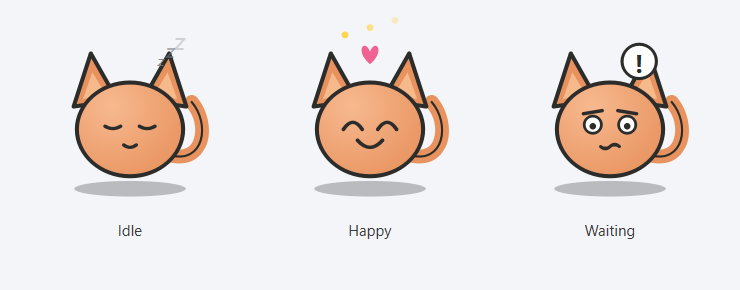

# Gitten

A cute pixel-style kitten that lives on your Windows taskbar and reacts to
git activity in a repo you point it at: it sleeps when idle, celebrates
after a commit, and looks worried when uncommitted changes pile up.



## How it works

Gitten watches one local git repository and drives a simple mood state
machine:

| State | Trigger | Visual |
|---|---|---|
| `idle` | No git activity for a while | Closed eyes, "zzz" above its head |
| `happy` | A commit was just made | Happy eyes, a small heart and sparkles |
| `waiting` | Uncommitted changes have sat around too long (30+ min by default) | Wide worried eyes, raised eyebrows, a "!" speech bubble |

Instead of polling `git status` on a timer, it watches `.git/COMMIT_EDITMSG`
(touched on every commit) and `.git/index` (touched on `git add`) with
[`watchdog`](https://pypi.org/project/watchdog/), and only runs
`git status --porcelain` when one of those files actually changes.

## v1.1: system awareness & a gentle nudge

On top of the git mood, Gitten shows an independent small status badge near
its head for things like low battery, charging, high CPU/memory usage, or
low disk space (`src/gitten/status_badge.py`), and gives one gentle
animated nudge with a speech bubble if you've spent 20+ minutes straight on
a distracting site or app (`src/gitten/distraction.py`), configurable via
`~/.gitten/distraction_config.json`. Right-click the kitten for a quick
stats menu (commits today, battery, watched repo, session uptime).
**Everything here runs and stays entirely on your machine -- no network
calls, no telemetry.**

## Running it

```bash
python -m venv .venv
.venv\Scripts\activate
pip install -e .
python -m gitten.main
```

On first run, Gitten asks which repository to watch. It sits near the
bottom-right of your primary screen, above the taskbar -- drag it anywhere
with the mouse, and it remembers where you left it. Right-click it (or use
the system tray icon) to change the watched repo or quit.

## Building the .exe

```bash
build_exe.bat
```

This produces a single portable `dist\Gitten.exe` via PyInstaller --
double-click to run, no install required. Must be run on Windows.

## Running tests

```bash
pip install -e .[dev]
pytest
```

The mood state machine (`src/gitten/mood.py`) is pure Python with no Qt
dependency, so it's fully unit tested (`tests/test_mood.py`). The GUI and
sprite-rendering code aren't unit tested -- verify those by running the app.

## Project structure

```
gitten/
├── src/gitten/
│   ├── main.py                # entry point: QApplication, tray, window, watcher wiring
│   ├── window.py               # transparent always-on-top draggable QWidget
│   ├── sprite.py                # QPainter drawing code for the kitten (all moods/poses)
│   ├── mood.py                  # pure git-mood state machine, no Qt imports
│   ├── git_watcher.py           # watchdog-based watcher emitting mood-relevant events
│   ├── status_badge.py          # pure state machine for battery/CPU/disk badges
│   ├── distraction.py           # pure distraction-nudge streak logic + list matching
│   ├── system_monitor.py        # thin psutil wrapper (battery/CPU/mem/disk)
│   ├── foreground_window.py     # thin win32gui wrapper (active window/process)
│   ├── attention.py             # pure sulking/reconciliation state machine
│   ├── notifications.py         # thin WinRT wrapper for the notification inbox
│   └── telegram_config.py       # pure Telegram credential/session path logic
├── scripts/
│   └── telegram_connection_test.py  # standalone Telegram login/listen test (v1.3)
├── tests/
│   └── test_*.py                # one file per pure module above
├── .github/workflows/ci.yml
├── pyproject.toml
├── build_exe.bat
└── LICENSE
```

## Roadmap / explicitly out of scope for v1

- Multiple kittens at once
- Reacting to GitHub Actions / CI status
- Unlockable skins/fur colors
- Sound effects
- Cross-platform support (Windows-only for now)

## License

MIT -- see [LICENSE](LICENSE).
