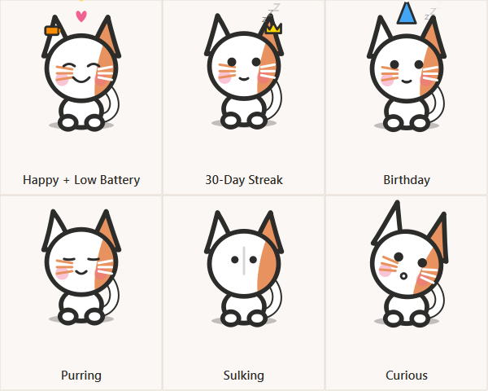
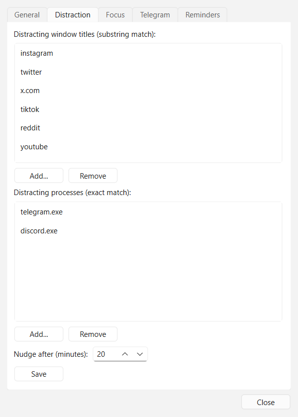
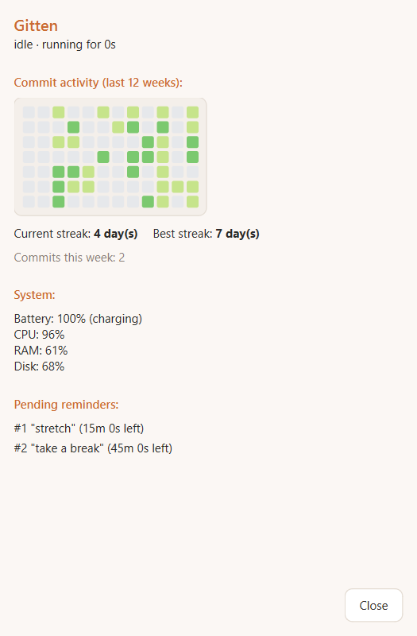

# Gitten

A kitten that lives on your Windows desktop and taskbar: it watches a git
repo, reacts to your system and your habits, and has enough of its own
personality (moods, sulking, purring, random one-liners) that it reads as a
pet rather than a status bar widget. It's also grown a second side since
then -- a command bar, a settings panel, and a dashboard -- so it's as much
a small assistant tool as it is a desktop companion.



## Features

Gitten has two sides: things it does **on its own** while it sits there,
and things **you invoke** when you want something from it.

### The ambient companion side

**Git awareness**
- **Mood**: `idle` (closed eyes, "zzz") when there's been no git activity
  for a while, `happy` (heart + sparkles) right after a commit, `waiting`
  (worried eyes, a "!" bubble) once uncommitted changes have sat around too
  long (30+ minutes by default).
- **Daily commit streak**: a small star (3+ days), a twinkling gold star
  (7+), or a crown (30+) appears near its head, recomputed from the repo's
  full commit history rather than kept as a fragile running counter.

**System awareness**
- A small badge near its head for critical/low battery, charging, high
  CPU/memory usage, or low disk space -- independent of mood, so it can be
  `happy` and show a badge at the same time.
- **Low-battery + uncommitted-changes combo**: no separate feature, just
  what naturally happens when both are true at once -- the `waiting`
  pose's "!" bubble becomes "‼" when a battery badge is also showing.

**Focus & productivity**
- A gentle nudge (a paw-wave + speech bubble) if you've spent 20+ minutes
  straight on a distracting site or app.
- A "watching" reaction (perked ears, focused eyes) while a matching
  test/build process is running. Gitten only observes running processes,
  not their exit codes, so this can't tell you pass from fail -- just that
  something's running.
- **Curiosity**: a quick head-tilt when you launch a genuinely new program
  (not just a new tab in something already running), on a cooldown so
  opening a whole workspace at once doesn't set it off repeatedly.
- **Reminders**: set with the command bar (see below) and delivered as a
  distinctly-styled alert bubble (amber, bold, an alarm-clock icon) rather
  than a routine nudge, so they're never mistaken for ambient chatter.

**Presence**
- **Real away detection**: after 10 minutes of no keyboard/mouse input
  anywhere on the system (not just git inactivity), it lies down into a
  deep-sleep pose -- ears drooping, tail curled in, a slower breath and a
  bigger "zzz". While away, curiosity, one-liners, and the mouse-chase
  spawn all go quiet, since nobody's there to see them.
- **Welcome back**: after a long-enough absence (30+ minutes), a small
  greeting the moment you return -- unless a reminder came due while you
  were gone, in which case that takes priority over the generic greeting.

**Personality & interaction**
- **Sulking & reconciliation**: ignore Gitten for 30+ minutes and it turns
  away; a few pets bring it back around through visible in-between poses.
- **Hover purr**: hold the cursor over it for a moment (~0.2s) and it
  purrs -- distinct from any mood or focus pose, and it wins over both
  except while sulking.
- **High-five**: double-click for a quick raised-paw animation.
- **Draggable**, with a short sparkle trail that trails behind it in real
  screen space as you drag it around.
- **Random one-liners**: an occasional friendly Persian one-liner in a
  speech bubble every 45-90 minutes, skipped (not queued) if you're
  sulking, already seeing a nudge, in the inbox view, or away.
- **Shooting star**: a small chance (~5%) that a one-liner is replaced by
  a sparkle streaking across the window instead.
- **Mouse-chase minigame**: every 45-90 minutes or so (independent
  cadence from the one-liners), a small mouse appears somewhere on
  screen and Gitten autonomously walks over to catch it, then walks back
  to wherever it was sitting. Dragging the cat mid-chase cancels it
  immediately and cleans up, the same "you always win" rule every other
  autonomous animation follows.

**Notifications**
- Right-click-free access to your Windows notifications from a small inbox
  panel that slides open in place of the pet view. Needs a one-time
  Windows permission grant the first time you open it (Gitten will prompt);
  if it's denied or unsupported on your system, the inbox just says so
  instead of erroring.

**Personalization**
- **Rename** it and **set its birthday** (tray menu or the settings
  panel's General tab -- `QSettings`, so both persist across restarts).
- A small accessory renders above its head on Halloween (witch hat), Yalda
  (a pomegranate), and its own birthday (a party hat).
- Its body tint shifts slightly cooler/moonlit between 11pm and 7am --
  computed fresh on every repaint, no separate state to keep in sync.

**Everything above runs and stays entirely on your machine -- no network
calls, no telemetry**, with the sole exception of the in-progress Telegram
integration (see Roadmap), which is opt-in and not yet wired into the
running app.

### The assistant-tool side

**Command bar** -- a small popup summoned with **Ctrl+Alt+G** from
anywhere (a system-wide hotkey), positioned right above the cat. Type a
command and press Enter; the reply shows up in the usual speech bubble.
Escape or clicking away closes it without doing anything.

| Command | What it does |
|---|---|
| `streak` | Current commit streak |
| `commits` | Commits made today |
| `battery` | Current battery percentage |
| `rename <name>` | Rename the cat |
| `chase` | Start the mouse-chase minigame right now |
| `remind <duration> <message>` | Set a reminder, e.g. `remind 10m take a break` (`s`/`m`/`h` units) |
| `reminders` | List pending reminders with their ids |
| `cancel <id>` | Cancel a pending reminder |
| `settings` | Open the settings panel |
| `dashboard` | Open the dashboard |
| `help` | List every command |
| `quit` | Exit Gitten |

(Pulled directly from `commands.py`'s own dispatch table and
`COMMANDS_HELP_TEXT` -- if you're customizing the app, that file is the
source of truth, not this table.) If Ctrl+Alt+G is already claimed by
another application, Gitten logs it and carries on hotkey-less for that
session -- there's currently no tray-menu fallback to open the bar another
way (see Roadmap).

**Settings panel** -- an ordinary window (tray menu -> "Settings...", or
the `settings` command), five tabs: General (repo/name/birthday), Distraction
(the nudge title/process lists + threshold), Focus (the watched test/build
substrings), Telegram (the favorite/bad sender lists), and Reminders (view
pending ones and cancel with a button instead of the command). Each tab's
Save button writes its config file, and for the ones with a live
in-memory counterpart (Distraction, Focus) it updates the already-running
app immediately too -- no restart needed. Telegram is the one exception:
it only persists, since nothing in the running app reads those lists back
out yet (see Roadmap).



**Dashboard** -- a second ordinary window (tray menu -> "Dashboard...", or
the `dashboard` command), read-only: a GitHub-style commit-activity heatmap
for the last 12 weeks, your current streak next to your best-ever streak,
this week's commit count, a battery/CPU/RAM/disk snapshot, and your pending
reminders. Refreshes automatically every few seconds while it's open.



## Windows

Gitten actually has two different *kinds* of window, and the distinction is
real architecture, not a cosmetic detail:

- **Overlay windows** -- the cat itself, the chased mouse, and the command
  bar popup. All frameless, transparent, always-on-top, and don't appear in
  the taskbar/alt-tab (`Qt.FramelessWindowHint | Qt.WindowStaysOnTopHint |
  Qt.Tool` + `Qt.WA_TranslucentBackground`). The cat and mouse additionally
  never steal keyboard focus (`Qt.WindowDoesNotAcceptFocus`), so they can
  sit on screen while you work without interrupting whatever you're typing
  into; the command bar is the one exception, since it's a real text box
  that has to be focusable to be usable.
- **Normal windows** -- Settings and Dashboard. Real title bars, ordinary
  minimize/close behavior, not always-on-top, not click-through -- plain
  `QDialog`s with no special flags beyond `Qt.Window`. These are edit/read
  surfaces, not something meant to float over your work, so they behave
  like every other application window on your desktop.

## How it's built

Rather than one large state machine, each of the ambient-companion areas
above is its own small, independent layer that gets composited together at
paint time: mood (`mood.py`, driven only by git activity), status badges
(`status_badge.py`, driven only by system readings), distraction/focus
(`distraction.py` / `focus.py`), attention/sulking (`attention.py`), and
seasonal/time-of-day rendering (`seasons.py`) all know nothing about each
other. That's deliberate, not incidental: it's what lets the cat be
`happy` from a commit, show a low-battery badge, and be mid-reconciliation
from a sulk, all at once, without any of those three systems needing to
special-case the others. Precedence between visually-competing overlays
(e.g. a hover purr vs. a focus reaction, or AWAY overriding everything) is
resolved once, explicitly, at the point they'd otherwise collide, rather
than baked into any one layer.

The assistant-tool side follows a second, complementary principle: **one
shared implementation, several thin entry points.** `commands.py`'s
dispatch table is the single place a typed command turns into an action --
each handler just calls the same method the tray menu or a keyboard
shortcut would already call (`rename` reuses `_apply_rename`, `settings`
reuses `_open_settings_panel`, and so on), never a separate copy of the
logic. The same pattern shows up again one level down: the settings panel's
Reminders tab, the dashboard's Reminders section, and the command bar's own
`reminders` reply all sort and format the same list through the exact same
two functions in `reminders.py`, rather than three independent copies that
could quietly drift apart from each other.

Most of the pure-logic layers have zero Qt imports and take their clock (or
RNG) as an argument rather than reading it internally, which is what makes
them fully unit-testable without a display or real elapsed time -- see
`tests/`. The Qt-facing code (`window.py`, `sprite.py`, `main.py`, and the
window classes) stays comparatively thin wiring on top.

Visually, everything now draws from one shared design system rather than
each surface inventing its own colors: `theme.py` defines the palette
(the cat's own coral body color is the primary accent), spacing, and
corner radius once, and the cat sprite, the command bar, every speech
bubble, and the Settings/Dashboard windows all read from it.

## Configuration

Most day-to-day configuration now has a real UI: open the **settings
panel** (tray menu -> "Settings...", or the `settings` command) rather than
hand-editing JSON. The underlying files are still exactly where they were
and still perfectly editable by hand if you prefer that -- the panel reads
and writes the same files, nothing changed about where they live.

| What | Where |
|---|---|
| Watched git repo, cat's name, cat's birthday | Settings panel's General tab (also the original tray-menu prompts, and first-run for the repo) -- persisted via `QSettings` |
| Distracting titles/processes + nudge threshold | Settings panel's Distraction tab -- `~/.gitten/distraction_config.json` (`{"titles": [...], "processes": [...], "threshold_minutes": ...}`), falls back to a shipped default list (instagram/twitter/x.com/tiktok/reddit/youtube titles, telegram.exe/discord.exe processes, 20 minutes) if missing |
| Test/build processes to react to | Settings panel's Focus tab -- `~/.gitten/focus_config.json` (`{"substrings": [...]}`), falls back to a shipped default list (pytest, npm test, npm run build, cargo test, go test) if missing |
| Telegram favorite/bad sender lists (see Roadmap) | Settings panel's Telegram tab -- `~/.gitten/telegram_lists.json`; configures who gets a reaction *once* Telegram is connected, which it isn't yet |
| Telegram credentials/session (see Roadmap) | `~/.gitten/telegram_config.json` + `~/.gitten/telegram.session*` -- never inside the project folder, no settings-panel UI for this (it's a one-time interactive login, not a list to edit) |
| Pending reminders | Settings panel's Reminders tab (view + cancel), the dashboard (view-only), or the `remind`/`reminders`/`cancel` commands -- `~/.gitten/reminders.json` |
| Window position | Remembered automatically wherever you last dragged it (`QSettings`) |

**Not yet configurable anywhere** -- deliberately out of scope when the
settings panel was built, not an oversight: badge thresholds, the
sulking/away timing windows, the global hotkey combo (`Ctrl+Alt+G`), and
the random spawn intervals for one-liners/mouse-chases. These stay
hardcoded for now (see Roadmap).

`QSettings("Gitten", "Gitten")` lives at
`HKEY_CURRENT_USER\Software\Gitten\Gitten` on Windows.

## Running it

```bash
python -m venv .venv
.venv\Scripts\activate
pip install -e .
python -m gitten.main
```

On first run, Gitten asks which repository to watch. It sits near the
bottom-right of your primary screen, above the taskbar -- drag it anywhere,
and it remembers where you left it. Right-click it for a stats menu (cat
name, commits today, streak, battery, watched repo, session uptime), press
**Ctrl+Alt+G** anywhere for the command bar, or use the system tray icon
for repo/rename/birthday/Settings/Dashboard/quit.

## Building the .exe

```bash
build_exe.bat
```

This produces a single portable `dist\Gitten.exe` via PyInstaller --
double-click to run, no install required. Must be run on Windows.

## Running tests

```bash
pip install -e .[dev]
pytest
```

Every pure-logic module (mood, status badges, distraction, focus,
attention, streak, particles, seasons, one-liners, notification formatting,
Telegram config/list paths, app-launch gating, mouse-chase timing, system
idle thresholds, command parsing/formatting, reminders, and the
`is_git_repo` repo-path check) has its own test file under `tests/`. The
Qt-facing code (`window.py`, `sprite.py`, `main.py`, and every window class)
isn't covered by pytest -- it's been verified end-to-end against real, live
widget/app instances during development, including real `QScreen.grabWindow`
screenshots for anything visual (see `DEVELOPMENT_NOTES.md`), not just by
running the app manually.

## Project structure

```
gitten/
├── src/gitten/
│   ├── main.py                  # entry point: QApplication, tray, window, watcher, all timers
│   ├── window.py                 # transparent always-on-top draggable QWidget; view/click/drag/hover/walk state
│   ├── sprite.py                  # QPainter drawing code for every mood/pose/badge/accessory
│   ├── mood.py                     # pure git-mood state machine (idle/happy/waiting), no Qt imports
│   ├── git_watcher.py              # watchdog-based watcher; commit/streak/commits-today/this-week helpers
│   ├── status_badge.py             # pure state machine for battery/CPU/mem/disk badges
│   ├── distraction.py              # pure distraction-nudge streak logic + title/process list matching/persistence
│   ├── focus.py                     # pure test/build process-name matching + config load/save
│   ├── system_monitor.py           # thin psutil wrapper (battery/CPU/mem/disk, running processes)
│   ├── foreground_window.py        # thin win32gui wrapper (active window/process)
│   ├── attention.py                # pure sulking/reconciliation state machine
│   ├── notifications.py            # thin WinRT wrapper + pure notification-text formatting
│   ├── streak.py                    # pure streak/heatmap/best-streak calculations from commit dates
│   ├── particles.py                 # pure fading-particle system (drag trail + shooting star + catch effect)
│   ├── seasons.py                   # pure seasonal-accessory + day/night-palette logic
│   ├── oneliners.py                 # pure random one-liner/interval/rare-event selection
│   ├── telegram_config.py          # pure Telegram credential/session path logic (no Telethon import)
│   ├── telegram_lists.py           # pure Telegram favorite/bad sender list load/save (no Telethon import)
│   ├── app_launch.py               # pure "did a genuinely new program just open" gate + cooldown
│   ├── visible_windows.py          # thin win32 wrapper: visible top-level windows' owning PIDs
│   ├── mouse_game.py                # pure mouse-chase spawn timing/position-picking logic
│   ├── mouse_window.py              # the small overlay window for the chased mouse sprite
│   ├── system_idle.py              # thin ctypes wrapper: real keyboard/mouse idle seconds + away threshold
│   ├── command_bar_hotkey.py       # raw ctypes RegisterHotKey wrapper for the global Ctrl+Alt+G hotkey
│   ├── command_bar_window.py       # the frameless popup for typed commands
│   ├── commands.py                  # pure command parsing + reply formatting for the command bar
│   ├── reminders.py                 # pure reminder parsing/scheduling/formatting + JSON persistence
│   ├── theme.py                     # shared design system: palette, spacing, corner radius, QSS
│   ├── settings_window.py          # the settings panel -- a normal window, 5 tabs
│   └── dashboard_window.py         # the read-only dashboard -- a normal window
├── scripts/
│   └── telegram_connection_test.py  # standalone Telegram login/listen script (see Roadmap)
├── tests/
│   └── test_*.py                   # one file per pure module above
├── assets/
│   ├── demo.png                     # the cat's own mood/state contact sheet, shown at the top of this file
│   ├── settings.png                 # settings panel screenshot, shown above
│   ├── dashboard.png                # dashboard screenshot, shown above
│   └── preview.png                  # superseded by demo.png; kept, not deleted, per past housekeeping notes
├── .github/workflows/ci.yml
├── pyproject.toml
├── build_exe.bat
└── LICENSE
```

## Roadmap

**Telegram integration is in progress, not unstarted, and its status hasn't
changed in several rounds.** A standalone connection-test script
(`scripts/telegram_connection_test.py`), secure credential/session handling
(`telegram_config.py`, everything under `~/.gitten/`, never inside the
project folder), and the favorite/bad sender list persistence
(`telegram_lists.py`, editable from the settings panel's Telegram tab) all
exist and are tested -- but the actual reactions (running over to the
Telegram taskbar icon, a "favorite contact" grab animation vs. a "bad
contact" hiss + warning badge, flashing the taskbar entry) are **still not
wired into the main app**, and `telegram_watcher.py` still doesn't exist.
The next step is building it and connecting it in `main.py`; it's blocked
on you supplying your own Telegram `api_id`/`api_hash` (from Telegram's own
site) to actually run the standalone script end to end first.

**Settings exist now, but don't cover everything** -- the panel was
deliberately scoped to consolidate configuration that already had a
load/save path, not to invent new configurability. Still hardcoded, not
exposed anywhere: badge thresholds, the sulking/away timing windows, the
global hotkey combo (`Ctrl+Alt+G`), and the random spawn intervals for
one-liners/mouse-chases. There's also no tray-menu fallback to open the
command bar if the hotkey fails to register (e.g. another app already owns
that combination) -- the hotkey is currently the only way in.

Genuinely still deferred, not just unstarted busywork:
- Pass/fail-aware test/build reactions (would require Gitten to launch the
  command itself rather than only observe it running)
- Live notification updates via WinRT's `NotificationChanged` event (the
  inbox currently does one fresh fetch each time it's opened)
- Reacting to GitHub Actions / CI status
- Decay during an interrupted reconciliation (petting partway through a
  sulk and never finishing currently just holds that stage indefinitely)
- Multiple kittens at once, unlockable skins/fur colors, sound effects,
  cross-platform support (Windows-only)

## License

MIT -- see [LICENSE](LICENSE).
